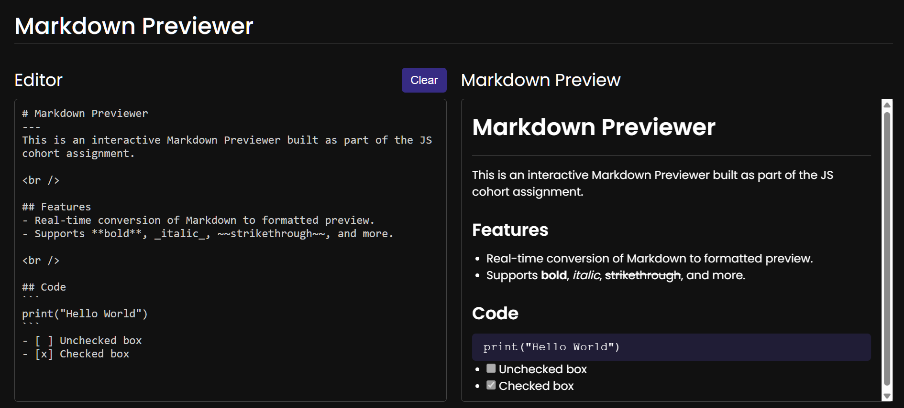

# Markdown Previewer

Hi there! 👋 This is an interactive Markdown Previewer built as part of the JS cohort assignment.

## Features

- Real-time conversion of Markdown to formatted preview.
- Supports **bold**, _italic_, ~~strikethrough~~, and more.
- Task lists with interactive checkboxes.
- Blockquotes and proper list formatting.

## Screenshots

  
_The Markdown Previewer_

## Deployment Link

You can try the app yourself here: [Markdown Previewer](https://codermodersd.github.io/cohort-md-assignment-2)
